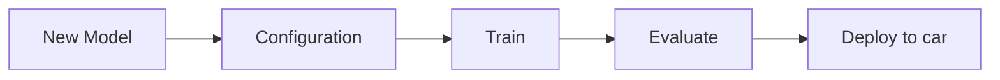

# **Welcome**

{align="center"}

## What is AWS DeepRacer?

AWS DeepRacer is the fastest way to get rolling with reinforcement learning (RL), featuring a fully autonomous, reinforcement learning-powered 1/18th scale race car, a 3D racing simulator, and an international racing league. Developers can participate in the AWS DeepRacer League for the chance to win the AWS DeepRacer Championship Cup, deploy their models onto the AWS DeepRacer for a real-world autonomous experience, and train, analyse, and tune RL models in the online simulator.:trophy:

[:material-cursor-default-click: Click to Know More about AWS DeepRacer](https://aws.amazon.com/deepracer/?nc=sn&loc=1){ .md-button }

## DeepRacer Workflow

## YouTube Videos :material-youtube:

- <https://www.youtube.com/watch?v=VwpFS1guqTg&pp=ygUJZGVlcHJhY2Vy>

- <https://www.youtube.com/watch?v=vCt-F2HscOU&pp=ygUJZGVlcHJhY2Vy>

- <https://www.youtube.com/watch?v=DAx42E9_Cug&pp=ygUJZGVlcHJhY2Vy>
