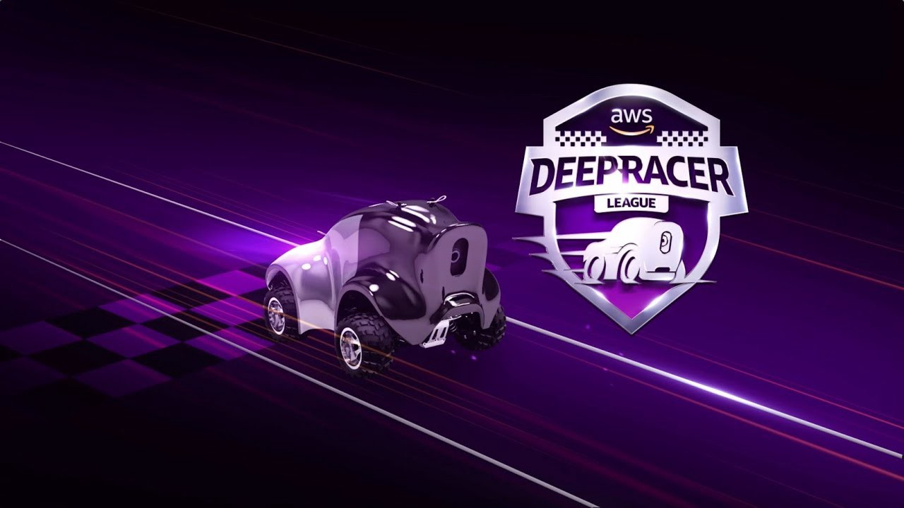

# Welcome

{align="center"}

## What is AWS DeepRacer?

AWS DeepRacer is the fastest way to get rolling with reinforcement learning (RL), literally, with a fully autonomous 1/18th scale race car driven by reinforcement learning, 3D racing simulator, and a global racing league. Developers can train, evaluate, and tune RL models in the online simulator, deploy their models onto AWS DeepRacer for a real-world autonomous experience and compete in the AWS DeepRacer League for a chance to win the AWS DeepRacer Championship Cup :trophy:

[Get to Know More about AWS DeepRacer](https://aws.amazon.com/deepracer/?nc=sn&loc=1){ .md-button .md-button--primary }

## DeepRacer Workflow

## YouTube Videos

- <https://www.youtube.com/watch?v=VwpFS1guqTg&pp=ygUJZGVlcHJhY2Vy>

- <https://www.youtube.com/watch?v=vCt-F2HscOU&pp=ygUJZGVlcHJhY2Vy>

- <https://www.youtube.com/watch?v=DAx42E9_Cug&pp=ygUJZGVlcHJhY2Vy>
