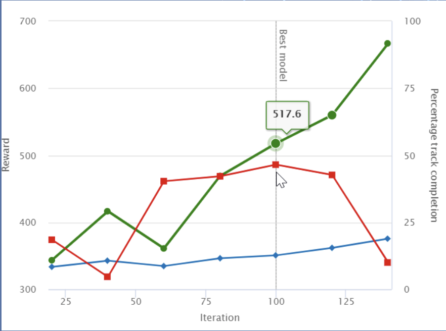
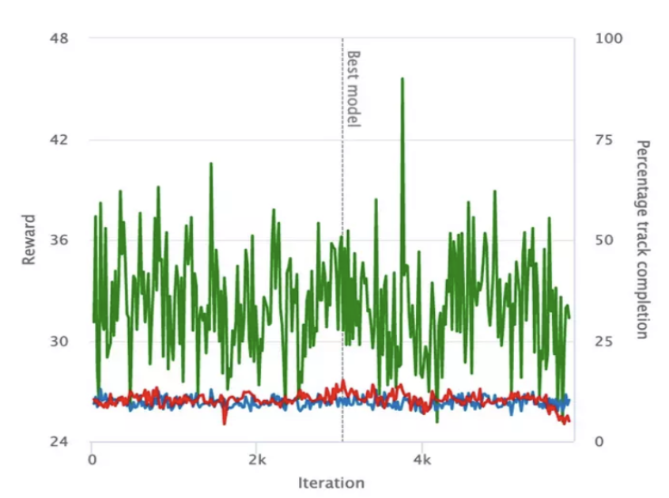

# Model Evaluation

## Reward Graph

{align="center" width="60%"}

:green_circle: Average reward

:large_blue_diamond: Average percentage completion (training)

:red_square: Average percentage completion (evaluating)

## The Model is not Improving

{align="center" width="60%"}

Solution:

Tune hyperparmeters e.g. increase epochs

## The Model is Overfitting

Overfitting refers to a situation where a machine learning model is trained too well on a particular dataset, to the point that it starts to memorize the training data instead of learning the underlying patterns and relationships in the data. When a model overfits, it performs well on the training data but poorly on new, unseen data.

{align="center" width="60%"}

Solution:

- Simplify your reward function
- Train with more tracks
- Reduce training time
