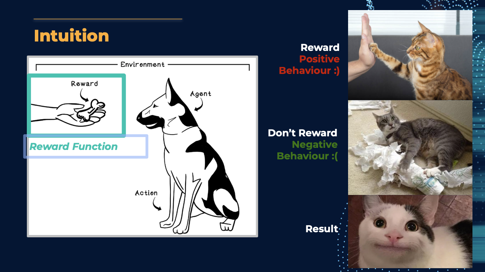
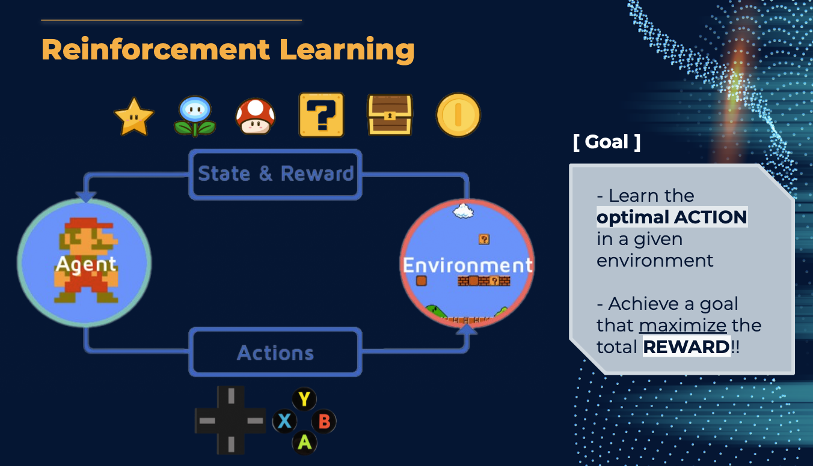
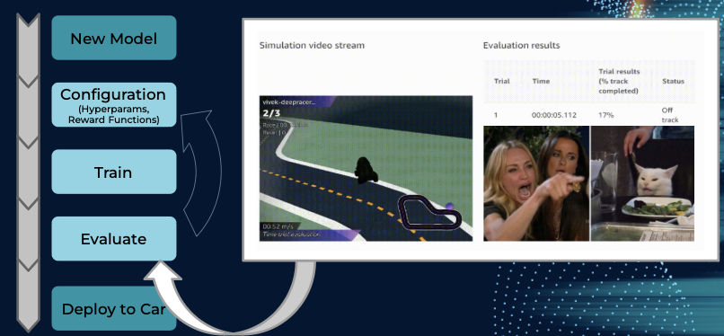

# Reinforcement Learning

## What is Reinforcement Learning?

Reinforcement learning is a type of machine learning that involves training agents to make decisions based on trial and error. In reinforcement learning, an agent learns to take actions in an environment to maximize a reward signal, which is a scalar value that indicates how well the agent is performing its task.

## Examples

{align=center}

{align=center}

## Reinforcement Learning in DeepRacer

{align=center}

## DeepRacer Workflow

{align=center}
