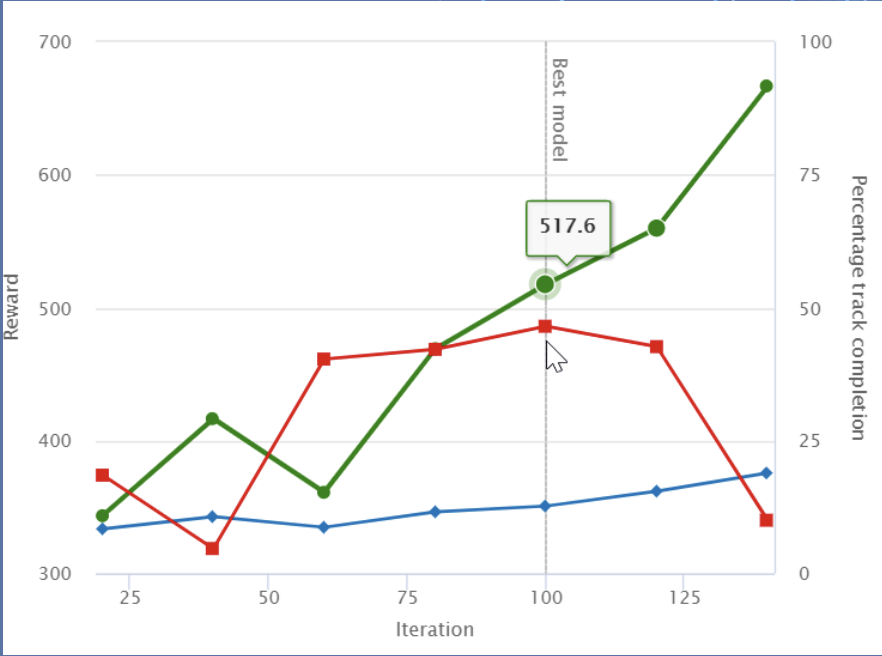

# Basic Concepts

## Reward Function

### What is reward function?

The reward function is python code that decribe immediate feedback in the form of reward and penalty to move from a given position on the track to a new position.

### What's the purpose of reward function?

The reward function ecourages the vehicle to make moves along the track quickly to reach its destination! :fire:

### Example (PAC MAN :simple-ghostery:)

{align="right" width="400"}

**Goal**: collect all the pallets + avoid ghosts

**Rewards**:

:thumbsup: Positive for pallets collected

:thumbsdown: Negative for each time unit in contact with a ghost

### Three basic reward functions

#### Follow Centerline

```python linenums="1"
    def reward_function(params):
    '''
    Example of rewarding the agent to follow center line
    '''

    # Read input parameters
    track_width = params['track_width']
    distance_from_center = params['distance_from_center']

    # Calculate 3 markers that are at varying distances away from the center line
    marker_1 = 0.1 * track_width
    marker_2 = 0.25 * track_width
    marker_3 = 0.5 * track_width

    # Give higher reward if the car is closer to center line and vice versa
    if distance_from_center <= marker_1:
        reward = 1.0
    elif distance_from_center <= marker_2:
        reward = 0.5
    elif distance_from_center <= marker_3:
        reward = 0.1
    else:
        reward = 1e-3  # likely crashed/ close to off track

    return float(reward)
```

#### Stay within Borders

```python linenums="1"
    def reward_function(params):
    '''
    Example of rewarding the agent to stay inside the two borders of the track
    '''

    # Read input parameters
    all_wheels_on_track = params['all_wheels_on_track']
    distance_from_center = params['distance_from_center']
    track_width = params['track_width']

    # Give a very low reward by default
    reward = 1e-3

    # Give a high reward if no wheels go off the track and
    # the agent is somewhere in between the track borders
    if all_wheels_on_track and (0.5*track_width - distance_from_center) >= 0.05:
        reward = 1.0

    # Always return a float value
    return float(reward)
```

#### Prevent zig-zag

```python linenums="1"
    def reward_function(params):
    '''
    Example of penalize steering, which helps mitigate zig-zag behaviors
    '''
    # Read input parameters
    distance_from_center = params['distance_from_center']
    track_width = params['track_width']
    abs_steering = abs(params['steering_angle']) # Only need the absolute steering angle
    # Calculate 3 marks that are farther and father away from the center line
    marker_1 = 0.1 * track_width
    marker_2 = 0.25 * track_width
    marker_3 = 0.5 * track_width
    # Give higher reward if the car is closer to center line and vice versa
    if distance_from_center <= marker_1:
        reward = 1.0
    elif distance_from_center <= marker_2:
        reward = 0.5
    elif distance_from_center <= marker_3:
        reward = 0.1
    else:
        reward = 1e-3  # likely crashed/ close to off track
    # Steering penality threshold, change the number based on your action space setting
    ABS_STEERING_THRESHOLD = 15 
    # Penalize reward if the car is steering too much
    if abs_steering > ABS_STEERING_THRESHOLD:
        reward *= 0.8
    return float(reward)
```

### Define your own reward function (Mario Kart as Example)

{align="center"}

#### Before coding your own function, find out

1. What status information do we have? e.g. Position of the car (shown in minimap)

2. What actions do we have? e.g. LEFT [ 1, 0, 0 ], FORWARD  [ 0, 1, 0 ], RIGHT [ 0, 0, 1 ]

3. When is reward calculated? (Sparsity of Reward Function) e.g. When the kart passed through a segment of the track / a checkpoint

#### Reward table

A reward table is a table that lists the rewards or penalties associated with different state-action pairs in a given environment. It is often used in reinforcement learning, a type of machine learning where an agent learns to take actions in an environment in order to maximize a cumulative reward signal.

| STATUS                    | REWARDS                          |
| :---------:               | :------------------------------: |
| `Normal`                  | -2 |
| `Collision`               | -20 |
| `Reaching a Checkpoint`   | 100 |
| `Finishing a Lap`         | 150 |

#### Overview

{align="center"}

## Model Evaluation

### Reward Graph

A reward graph is a graphical representation of the rewards or penalties associated with different actions that an agent can take in a given environment. The goal of an AI agent is typically to maximize the cumulative reward it receives over time by choosing actions that lead to higher rewards.

{align="center" width="60%"}

:green_circle: Average reward

:large_blue_diamond: Average percentage completion (training)

:red_square: Average percentage completion (evaluating)

### The Model is not Improving

{align="center" width="60%"}

Solution:

Tune hyperparmeters e.g. increase epochs

### The Model is Overfitting

Overfitting refers to a situation where a machine learning model is trained too well on a particular dataset, to the point that it starts to memorize the training data instead of learning the underlying patterns and relationships in the data. When a model overfits, it performs well on the training data but poorly on new, unseen data.

{align="center" width="60%"}

Solution:

- Simplify your reward function
- Train with more tracks
- Reduce training time
